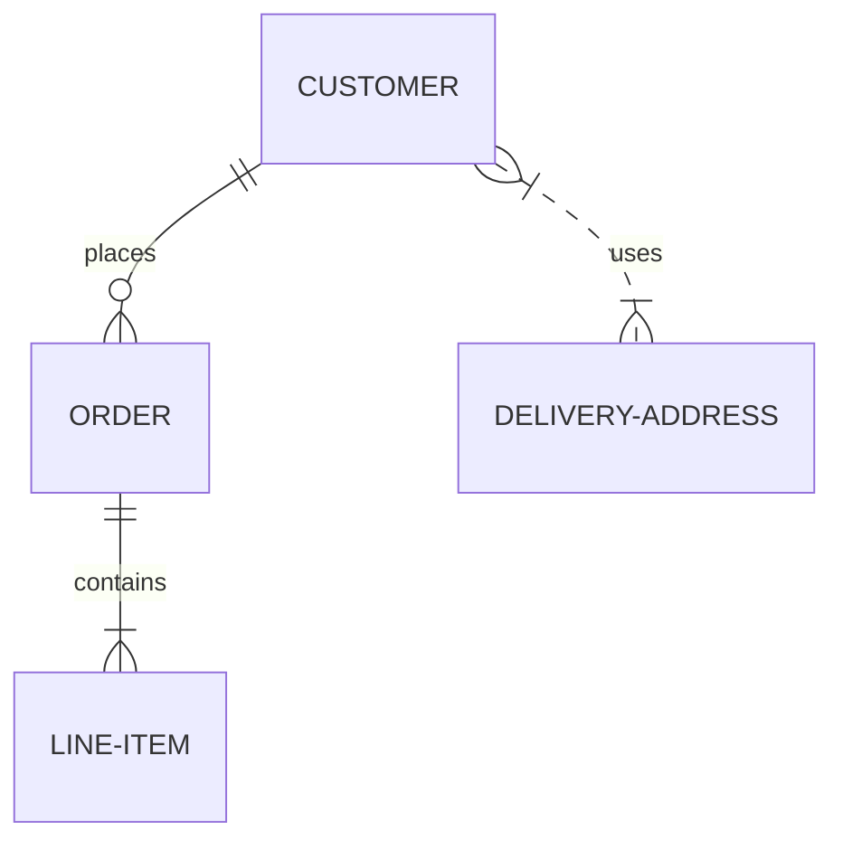

# Entity and relation types

Notes on figuring out the types of relations between entities. And also something on the entities. Maybe something about disambiguation as well.

To start thinking about entities and the relations between them is to enter the realm of philosophy and especially [Metaphysics](https://en.wikipedia.org/wiki/Metaphysics) and the old history of thinking about how things are and how they are [related](https://en.wikipedia.org/wiki/Relations_(philosophy)).

## Glossary

Placeholders from Wikipedia.

### Named entities (NE)

> In information extraction, a named entity is a real-world object, such as a person, location, organization, product, etc., that can be denoted with a proper name. It can be abstract or have a physical existence. Examples of named entities include Barack Obama, New York City, Volkswagen Golf, or anything else that can be named. Named entities can simply be viewed as entity instances (e.g., New York City is an instance of a city).
>
> [`Named entity` on Wikipedia](https://en.wikipedia.org/wiki/Named_entity)

### Named-entity recognition (NER)

> Named-entity recognition (NER) (also known as (named) entity identification, entity chunking, and entity extraction) is a subtask of information extraction that seeks to locate and classify named entities mentioned in unstructured text into pre-defined categories such as person names, organizations, locations, medical codes, time expressions, quantities, monetary values, percentages, etc.
>
> —[`Named-entity recognition` on Wikipedia](https://en.wikipedia.org/wiki/Named-entity_recognition)

### Entity Linking (EL)

> In natural language processing, entity linking, also referred to as named-entity linking (NEL),[1] named-entity disambiguation (NED), named-entity recognition and disambiguation (NERD) or named-entity normalization (NEN) is the task of assigning a unique identity to entities (such as famous individuals, locations, or companies) mentioned in text. For example, given the sentence "Paris is the capital of France", the idea is to determine that "Paris" refers to the city of Paris and not to Paris Hilton or any other entity that could be referred to as "Paris". Entity linking is different from named-entity recognition (NER) in that NER identifies the occurrence of a named entity in text but it does not identify which specific entity it is (see Differences from other techniques).
>
> [`Entity linking` on Wikipedia](https://en.wikipedia.org/wiki/Entity_linking)

## Entities

MIM-GOLD-NER tagged the MIM-GOLD 21.05 corpus with NE's and used eight types[^1]:

* `PERSON` – names of humans, animals and other beings, real or fictional.
* `LOCATION` – names of locations, real or fictional, i.e. buildings, street and place names, both real and fictional. All geographical and geopolitical entities such as cities, countries, counties and regions, as well as planet names and other outer space entities.
* `ORGANIZATION` – companies and other organizations, public or private, real or fictional. Schools, churches, swimming pools, community centers, musical groups, other affiliations.
* `MISCELLANEOUS` – proper nouns that don’t belong to the previous three categories, such as products, books and movie titles, events, such as wars, sports tournaments, festivals, concerts, etc.
* `DATE` – absolute temporal units of a full day or longer, such as days, months, years, centuries, both written numerically and alphabetically.
* `TIME` – absolute temporal units shorter than a full day, such as seconds, minutes, or hours, both written numerically and alphabetically.
* `MONEY` – exact monetary amounts in any currency, both written numerically and alphabetically.
* `PERCENT` – percentages, both written numerically and alphabetically

We match the EL data with this NER data for potentially showing to the person marking the data.

This could pose a potential trouble when marking relations since asking someone to connect `MISCELLANEOUS` to `MISCELLANEOUS` could be weird. There's a potential of adding user generated fine-grained tagging ontop of/along side marking the relations.

[^1]: [@20.500.12537/230]

### Potential fine-grained types

At least the ones mentioned in the MIM-GOLD-NER dataset:

* products
* book titles
* movie titles
* events
  * wars
  * sports tournaments
  * festivals
  * concerts

### Types of types

If we dig a little deeper we can start thinking about types as a tree (examples taken from NER dataset examples and expanded on), e.g.:

* `PERSON`
  * `NAME`, full (legal?) name.
  * `ALIAS`, nicks, other names the person is known as.
* `ORGANIZATION`
  * `COMPANY`
  * `SCHOOL`
  * `CHURCH`
  * `SWIMMING_POOL`
  * `COMMUNITY_CENTER`
  * `MUSICAL_GROUP`
* `LOCATION`
  * `COUNTRY`
  * `STREET`
  * `BUILDING`
  * `PLACE`, named place
  * `CITY`
  * `COUNTY`
  * `REGION`
  * `PLANET`
* `DATE`
  * `YEAR`
  * `DATE`
  * `WEEKDAY`
  * `DATETIME`
* `TIME`
  * `HOUR`
  * `MINUTE`
  * `SECOND`
* `UNIT`
  * `MONEY`
  * SI units?
* `PERCENT`
* `DEGREE` from a school
* `ART` or `WORK`?
  * `BOOK`
  * `SONG`
  * `MOVIE`
  * `ALBUM`
  * `SONG`
  * `AUTHOR`
* `EVENT`
  * `WAR`
  * `SPORT_TOURNAMENT`
  * `FESTIVAL`
  * `CONCERT`
* `PRODUCT`
* `BRAND` ?
* `GROUP`
  * `POLITICAL_PARTY`
  * `BAND`
* `SPECIE`

In a perfect setup we would not have `MISCELLANEOUS` as a type.

TODO is this an exhaustive list on WikiData, maybe `description` but that's too detailed or not too detailed(?), e.g. for [Iceland](https://www.wikidata.org/wiki/Q189) it's `country in the North Atlantic Ocean` but for [Hvannadalshnjúkur](https://www.wikidata.org/wiki/Q140084) it's just `mountain`.

TODO go further here? Probably not since it's not related to the project per se.

## Relations

### Relation notation

What notation do we use for relations? Does it include the type of the entity?

`<X, R, Y>`.

[Finitary relations](https://en.wikipedia.org/wiki/Finitary_relation)?

### Types of relations

Is there a standard for how these are written? `verb` potentially followed by `preposition` or `verb`? Is it dependant on the types it relates? E.g. `PERSON` to `PERSON`, `PERSON` to `TIME`. We should be able to create an exhaustive list of the "legal" relations. We could extract this to fine-grain the type, e.g. if `PERSON` => `MISCELLANEOUS` is marked with a `graduated_with` it should mean that `MISCELLANEOUS` is `DEGREE`.

* Work or organization related
  * `works_for`
  * `started_work`, this really does not work if a person has more than one `PERSON` => `ORGANIZATION` connection, needs to know about all three (person, org, date).
  * `ended_work`
  * `work_title`
  * `founded`
* Education
  * `studied_at`
  * `teached_at`
  * `graduated_with` (only `PERSON` => `DEGREE`)
* Non-profit, charities
  * `supports`
  * `supported_by`
* Life events
  * `birth_place`
  * `birth_date`
* Attendance
  * `attended`, an event, e.g. `<"Jane Doe", "attended", "some-concert">
* Belongs to
  * `is`, very generic, e.g. `<"John Doe", "is", "homo sapiens">`
* Categorization
  * `is_subcategory`
  * `is_supercategory` (that's not the correct nomenclature, superior? just category?)
* Location
  * `located_at`, here a transitive relation could be used to connect an entity to a region/city/country/planet based on a single connection to a building (given that the building has its own `located_at`)
* Family relation
  * `parent_of`
  * `child_of` here we could define that `parent-child` is asymmetric (don't think that's right nomenclature) so if `<A, child_of, B>` we know that `<B, parent_of, A>`
  * `partner_of`
  * `blood_relative_of`
  * `ancestor_of`
  * `sibling_of`
* Work or art
  * `author_of`
  * `person_in`

### Relationship cardinality

Relations can have a defined [cardinality](https://en.wikipedia.org/wiki/Cardinality_(data_modeling)) which can be used to ensure quality, show missing relations, or more (what?)

* one-to-one
* one-to-many
* many-to-one
* many-to-many

### Properties of relations

Each relation can have defined properties based on [mathematical relations](https://en.wikipedia.org/wiki/Relation_(mathematics)), examples are taken straight from Wikipedia:

* `Reflexive`
* `Irreflexive`
* `Symmetric`
  * > For example, "is a blood relative of" is a symmetric relation, because x is a blood relative of y if and only if y is a blood relative of x."
* `Antisymmetric`
* `Asymmetric`
* `Transitive`
  * > For example, "is ancestor of" is a transitive relation, while "is parent of" is not.

> For example, "is less than" is irreflexive, asymmetric, and transitive, but neither reflexive nor symmetric, "is sister of" is symmetric and transitive, but neither reflexive (e.g. Pierre Curie is not a sister of himself) nor asymmetric, while being irreflexive or not may be a matter of definition (is every woman a sister of herself?), "is ancestor of" is transitive, while "is parent of" is not. Mathematical theorems are known about combinations of relation properties, such as "A transitive relation is irreflexive if, and only if, it is asymmetric"

### Other well defined relations

How do we connect to, or learn from, other well defined relations and taxonomies, e.g.

* Biological taxonomy.
* `ISBN` numbers.
* Specific locale taxonomies, e.g. "dómsmál", "lög" or "reglugerðir" in Iceland.

### Relation metadata

Should the relation have metadata? E.g. datetime information, location. Or should it be another relation? Probably the second one, but we could always map between the two.

```text
<"Jón Sigurðsson", "birth_place", "Arnarfjörður">
<"Jón Sigurðsson", "birth_date", "17 June 1811">
```

### Other sources

[Wikipedia Relation Extraction Data v1.0](http://cs.iit.edu/~culotta/data/wikipedia.html) lists the relations from [Integrating Probabilistic Extraction Models and Data Mining
to Discover Relations and Patterns in Text](http://cs.iit.edu/~culotta/pubs/culotta06integrating.pdf):

* `job_title`
* `visited`
* `birth_place`
* `associate`
* `birth_year`
* `member_of`
* `birth_day`
* `opus`
* `death_year`
* `death_day`
* `education`
* `nationality`
* `executive`
* `employer`
* `death_place`
* `award`
* `father`
* `participant`
* `brother`
* `son`
* `associate_competition`
* `wife`
* `superior`
* `mother`
* `political_affiliation`
* `friend`
* `founder`
* `daughter`
* `husband`
* `religion`
* `influence`
* `underling`
* `sister`
* `grandfather`
* `ancestor`
* `grandson`
* `inventor`
* `cousin`
* `descendant`
* `role`
* `nephew`
* `uncle`
* `supported_person`
* `granddaughter`
* `owns`
* `great_grandson`
* `aunt`
* `supported_idea`
* `great_grandfather`
* `gpe_competition`
* `brother_in_law`
* `grandmother`
* `discovered`

### Examples

TODO examples that help me shape this thinking and can be used for "training material".

TODO use mermaid [Entity Relationship Diagrams](https://mermaid-js.github.io/mermaid/#/entityRelationshipDiagram).



## Disambiguation

TODO.
